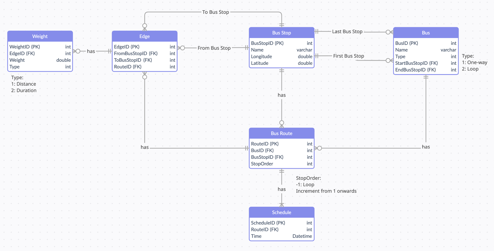
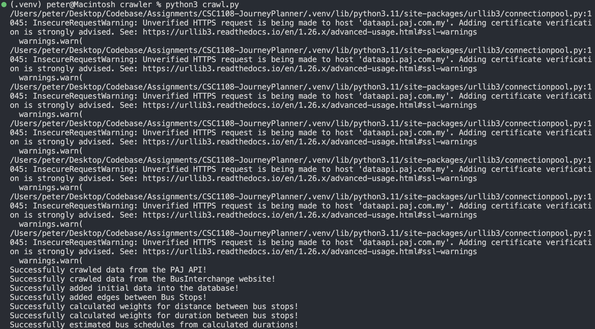

# 🚌 CSC1108 (Group 7) Journey Planner
Journey Planning application designed to enable commuters to plan their journey across Johor Bahru, Malaysia using the state's free bus service, Bas Muafakat Johor ([BAJ](https://paj.com.my/bas-muafakat-johor/)). A video demonstration of the application is provided in this [link](https://www.youtube.com/watch?v=iclYNXT16lM).

## Team Members
- Peter Febrianto Afandy​ (2200959)​​
- Adrian Pang Zi Jian​ (2200692)​​
- Muhammad Nur Dinie Bin Aziz (2200936)​​
- Ryan Lai Wei Shao (2201159)​​
- Jeffrey Yap Wan Lin​ (2201018)​

## List of Contents
- [Project Scope & Assumptions](#project-scope--assumptions)
- [System Design](#system-design)
- [Features](#features)
- [User Flow](#user-flow)
- [Algorithms Used](#algorithms-used)
- [Data Structures Used](#data-structures-used)
- [Project Components](#project-components)
- [Getting Started](#getting-started)
- [Program Usage](#program-usage)

## Project Scope & Assumptions
---
Due to the complexity of designing a bus journey planning application, this application is limited to providing bus route planning for the following bus services (as defined in the project specifications provided):
- Loop Services
    - P101 – Larkin Terminal ⊃ Johor Bahru City
        - Start: Larkin Terminal
        - End: Larkin Terminal
    - P106 – PPR Sri Stulang ⊃ AEON Tebrau City
        - Start: Hub PPR Sri Stulang
        - End: Hub PPR Sri Stulang
    - P202 – Taman Universiti ⊃ Taman Ungku Tun Aminah
        - Start: Taman Universiti Terminal
        - End: Taman Universiti Terminal
    - P403 – Econsave Senai ⊃ Skudai Parade
        - Start: Econsave Senai
        - End: Econsave Senai
- One-Way Services
    - P102 – PPR Sri Stulang ⇔ Majlis Bandaraya Johor Bahru
        - P102-01
            - Start: Hub PPR Sri Stulang
            - End: Majlis Bandaraya Johor Bahru
        - P102-02
            - Start: Majlis Bandaraya Johor Bahru
            - End: Hub PPR Sri Stulang
    - P211 – Taman Universiti ⇔ Larkin Terminal
        - P211-01
            - Start: Taman Universiti Terminal
            - End: Larkin Terminal
        - P211-02
            - Start: Larkin Terminal
            - End: Taman Universiti Terminal
    - P411 – Kulai ⇔ Larkin Terminal
        - P411-01
            - Start: Kulai Terminal
            - End: Larkin Terminal
        - P411-02
            - Start: Larkin Terminal
            - End: Kulai Terminal

The following bus stops were excluded (*instructed to ignore bus stops in the dataset*):
- KFC (Road side)
    - P202
- Tesco Lotus (Road side)
    - P202
- bef Jalan Kempas Lama
    - P211-01
    - P411-01

The following assumptions were also taken to simplify the development of the application:
1. Assume all bus service information (ie coordinates) provided in the `bus_stop.xlsx` dataset are correct (minor corrections were made).
2. Assume all buses will adhere to the specified bus schedule every day of the week, not taking into account any other factors (ie bus breakdowns).
3. Assume all buses will travel at the normal speed of `70km/h`.
4. Assume users will take a bus to travel to their destination, regardless of the distance between their starting point and ending point (ie 10 meter difference only).

## System Design
---
This application consists of the following components:
1. Database (GCP Cloud server)
2. Flask Web Application
3. Telegram Bot
4. API Integrations (Google Map, OSRAM, PAJ, Gmail)


This application utilises a MySQL database hosted on the cloud through the [Google Cloud Platform](https://cloud.google.com/sql). However, the application also supports the use of a local MySQL database, should the cloud server be unavailable. 

The main user interface for this application is deployed using the [Flask](https://flask.palletsprojects.com/en/2.2.x/) Python web framework. The Flask application is responsible for getting all user inputs, the processing of the path to a given destination, and displaying the results to the user. A chat-based user interface using a [Telegram bot](https://t.me/Johor_Planner_Bot) is also provided.

## Data Structures Used
---


## Algorithms Used
---
Two different algorithms are used to provide journey planning: 

1. Dijkstra Shortest Path with minimum bus transfer
    - Dijkstra’s seeks the shortest path between start node and next node

2. A Star algorithm with heuristic function
    - A Star seeks the shortest time between start node and end node
    - Performs like Dijkstra but with heuristic function calculating estimated weight to end node
    - Calculated using Haversine distance and must be admissible (NEVER overestimated)

A Star node selectop loop


Heuristic Function<br>


## Features
---
<u>Flask User Interface</u><br>
The main user interface for this application is hosted using the Flask web framework. Flask is used to integrate Python code together with the various web components (HTML, CSS and Javascript). A sample screenshot of the user interface is provided below:


<u>Telegram Bot User Interface</u><br>
To supplement the main application, a [Telegram bot](https://t.me/Johor_Planner_Bot) was also created for users to perform bus journey planning using a chat-base interface. A sample screenshot of the chat-based interface is provided below:


<u>Pengangkutan Awam Johor (PAJ) API</u><br>
The API provided by Malaysia's (Johor) public transportation provider, [PAJ](https://dataapi.paj.com.my/) is used during the initial population of data into the database, and the planning of routes (specifically live bus data). Live bus data will be presented in the displayed map, and live bus data can be toggled to be integrated into the route planning with the A Star algorithm.

<u>Google Maps API</u><br>
The [API](https://developers.google.com/maps) provided by Google Maps is used, specifically for the calculation of distances between bus stops, as well as general wayfinding to the starting bus stop and to the destination point during the last mile connectivity. The following API were used:
- Distance Matrix
- Geoencoding
- Reverse Geoencoding
- Directions

<u>Web Crawler</u><br>
To facilitate future route expansion and to automate the getting of bus schedule information, a web crawler was created to programmatically scrape the relevant bus schedule information. The crawler is designed for portability for ease of future expansion.

<u>User Validations</u><br>
Validation of user inputs, such as their given coordinates and text addresses was performed to make the application more robust.

<u>Email</u><br>
Upon completion of the bus journey planning, users can choose to send a copy of the planned journey to themselves via email.

<u>Database</u><br>
A MySQL database was designed to store the bus route information. The database design is provided in the Entity Relationship Diagram below.

A high level overview of each table in the database is provided below:
- Bus
    - BusID (Primary Key)
    - Name
    - Type
        - `1`: One-way
        - `2`: Loop
    - StartBusStopID
    - EndBusStopID
- Bus Route (Bus to Bus Stop mappings)
    - RouteID (Primary Key)
    - BusID
    - BusStopID
    - StopOrder
        - `-1` : Loop
        - `1, 2, ...` : Increment from 1 onwards
- Schedule
    - ScheduleID (Primary Key)
    - RouteID
    - Time
- Bus Stop
    - BusStopID (Primary Key)
    - Name
    - Longitude
    - Latitude
- Edge (Bus Stop Connection)
    - EdgeID (Primary Key)
    - FromBusStopID
    - ToBusStopID
    - RouteID
- Weight
    - WeightID (Primary Key)
    - EdgeID
    - Weight
    - Type
        - `1`: Distance
        - `2`: Duration

## User Flow
---
The following user flow is used for the entire journey planner application:
1. User enter inputs
    - Starting Address 
    - Destination Address
Route option (Shortest or Fastest Path)
2. Validate user’s inputs
    - Convert address to coordinates or vice versa
    - Locate nearest bus stop from start address and end address
3. Guide user to bus stop, if not already there (walking directions)
    - Guide user to nearest bus stop
4. Determine bus route
    - Run selected path algorithm (Shortest or Fastest Path)
    - Determine bus route from nearest bus stop 
    - Display the bus route and number to take at each bus stop
5. Guide user to endpoint, if not already there (walking directions)
- Guide user to destination

## Project Components
---
```
README.md (this file)

requirements.txt (program dependencies)

crawler/ (contains crawler programs)

flask_application/ (contains user interface programs)

docs/ (contains documentation images)

```
There are two main components/folders for this project:
1. Crawler
    - Used for getting initial Bus and Bus Stop information from various sources, including the dataset provided, [BusInterchange ](https://businterchange.net/johorbus.html) website, and the API provided by Malaysia's (Johor) public transportation provider, Perbadanan Pengangkutan Awam Johor ([PAJ](https://dataapi.paj.com.my/)).
    - Programs in this folder are generally not required to be executed as the necessary information have already been obtained, unless you are planning on setting up the database from scratch again. More instructions will be provided in the [program usage](#program-usage) section below.
2. Flask Application
    - Used to run the main user interface for the Journey Planner application.
    - Used to run the Telegram chat-based interface for the Journey Planner application.
    - This folder holds all necessary program components for getting the user's inputs, processing the path to a given destination, and outputting the results.

## Getting Started
---
1. Download all required [files and folders](#project-components) for this project.
2. Ensure that you have `python3` and `pip3` installed on your machine. Click [here](https://www.python.org/downloads/) for installation instructions if they are not already installed.
3. Install the necessary program dependencies for this project by running the following command on a terminal:
    ```
    pip3 install -r requirements.txt
    ```
    **Ensure that you are in the same working directory as the program files*


## Program Usage
---
### <u>Initial Project Setup</u>
This project utilises a Cloud MySQL database that have already been pre-configured for use. You can **skip this section** if you don't plan on re-crawling and setting up the database again from scratch.

If you plan on just setting up a local MySQL database, follow the instructions [here](#local-database-configurations). <br>
If you plan on setting up the entire database from scratch, follow the instructions [here](#full-database-setup). 

#### Local Database Configurations
---
Follow the instructions below to setup a local database for the application:
1. Ensure that you have installed MySQL on your machine. For installation instructions, click [here](https://dev.mysql.com/doc/mysql-installation-excerpt/5.7/en/).
2. On a terminal, run the following command to import the pre-configured database:
    ```
    mysql -u<username> -p < crawler/sql/DB_24March2023.sql
    ```
3. Modify the configuration file in `flask_application` to connect to the local database instead of the cloud database. The following changes are required:
    ```
    db_host = "localhost"
    db_user = "username"
    db_password = "password"
    db_schema = "DSA_JP" (Generally unchanged, unless your schema has a different name)
    ```

#### Full Database Setup
---
Follow the instructions below to setup an empty database, and populate it with crawled data for the application:
1. Ensure that you have installed MySQL on your machine. For installation instructions, click [here](https://dev.mysql.com/doc/mysql-installation-excerpt/5.7/en/).
2. On a terminal, run the following command to create the bare bone database (with no data):
    ```
    mysql -u<username> -p < crawler/sql/DB_NoData.sql
    ```
3. Ensure that the following program flags are set to `True` in the crawler's configuration file (`crawler/config.py`):
    ```
    # Program Flags
    LOCAL_DB = True
    CRAWL_API = True       
    CRAWL_WEB = True       
    UPDATE_DB = True       
    UPDATE_EDGES = True    
    UPDATE_WEIGHTS = True 
    ```
4. Create a copy of the `local_config_bak.py` local database configuration file
    ```
    cp crawler/local_config_bak.py crawler/local_config.py
    ```

5. Enter your local database's configurations into the `local_config.py` file. The following information should be included:
    ```
    db_host = "localhost"
    db_user = "username"
    db_password = "password"
    db_schema = "DSA_JP" (Generally unchanged, unless your schema has a different name)
    ```
6. Execute the crawler program (`crawl.py`) to obtain the required information using the following command on a terminal: <br>
    **Ensure that you are in the `crawler/` working directory*
    ```
    python3 crawl.py
    ```
    
    A sample output of the program's execution is provided below. You can ignore HTTP request warnings. 
    
7. Modify the configuration file in `flask_application` to connect to the local database instead of the cloud database. The following changes are required:
    ```
    db_host = "localhost"
    db_user = "username"
    db_password = "password"
    db_schema = "DSA_JP" (Generally unchanged, unless your schema has a different name)
    ```
### Program Execution
To run on browser:
1. Run the Flask application using the following command on a terminal:
    <br>**Ensure that you are in the `/flask_application` directory*
    ```
    python3 run.py 
    ```

    If you want to utilise live bus data with the A Star algorithm, modify the following program flag in `cloud_config.py` to `True`:
    ```
    INTEGRATE_LIVE_BUS = False # Change to True
    ```

2. Navigate to [`localhost:8080`](http://localhost:8080) on your browser, and start journey planning!

To run on Telegram:
1.  Run the Telegram Bot application using the following command on a terminal:
    <br>**Ensure that you are in the `/flask_application` directory*
    ```
    python3 telebot_server.py 
    ```
2. Search "Johor_Planner_Bot" on your Telegram and activate bot with '/start', and start journey planning!
    <br>**You can also use browser by navigating to [Telegram bot](https://t.me/Johor_Planner_Bot)*